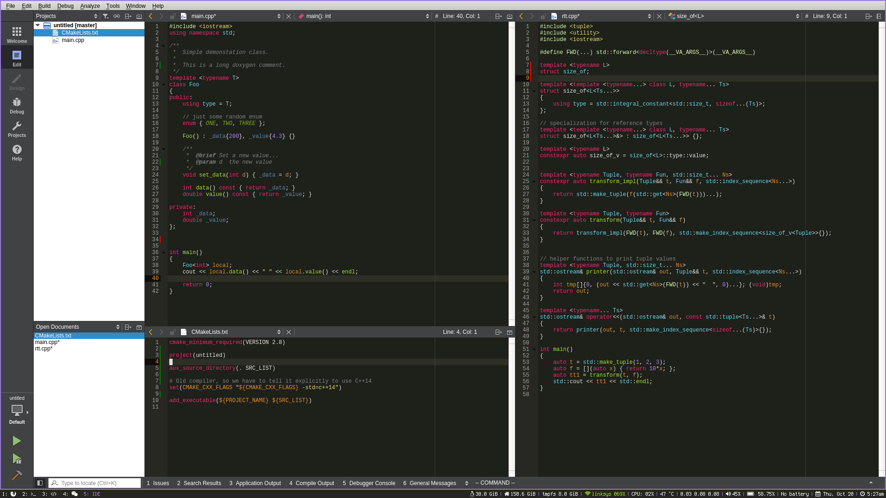

## Monokai color theme for Qt Creator

The color theme is based on TextMate's monokai theme. The color definitions have
been taken from Vim's [molokai](https://github.com/tomasr/molokai) color scheme.

#### Screenshot



#### Installation

Copy the `monokai.xml` file into the styles directory:
```bash
$ cp monokai.xml $HOME/.config/QtProject/qtcreator/styles
```

In Qt Creator go to _Tools -> Options -> Text Editor -> Font & Colors_ and
select Monokai under "Color Scheme".
